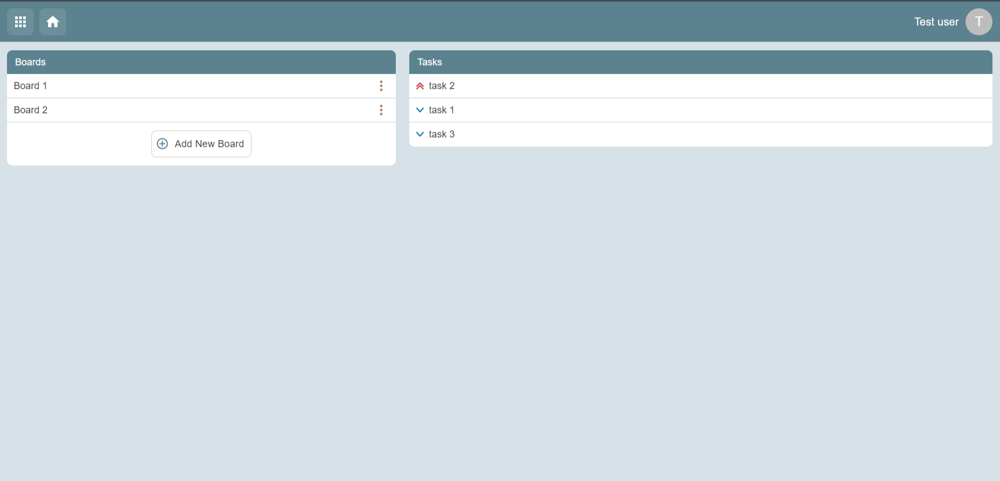
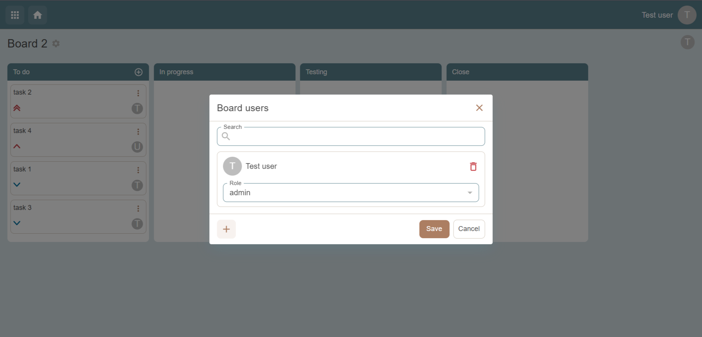
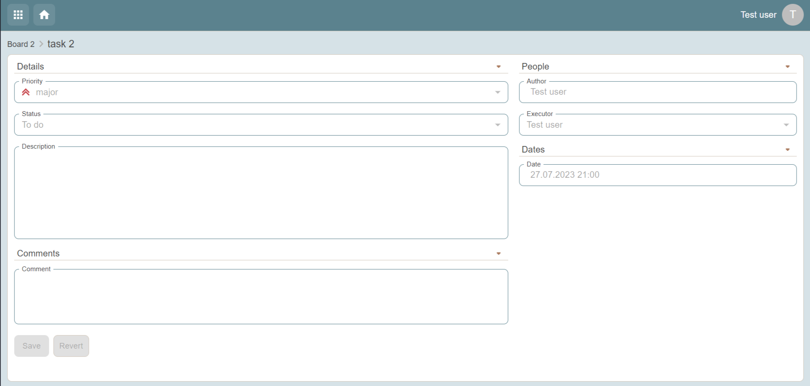

# To do

An application for managing tasks.

## Features

- Creating boards with tasks and subtasks
- Differentiation of user permissions depending on the role
- Real-time board status update
- Adaptive (the ability to use the application on all types of devices)
- Light/dark themes
- The ability to grant permissions to various actions

## System

- Main page
  
- Board page
  
- Task page
  

___

|      | version |
|------|---------|
| node | 16.14.2 |
| yarn | 1.22.18 |
